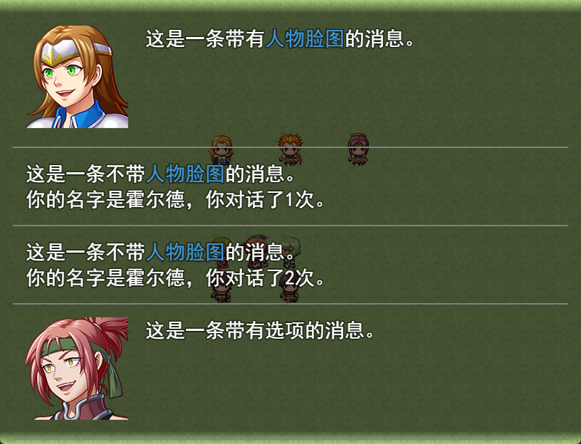
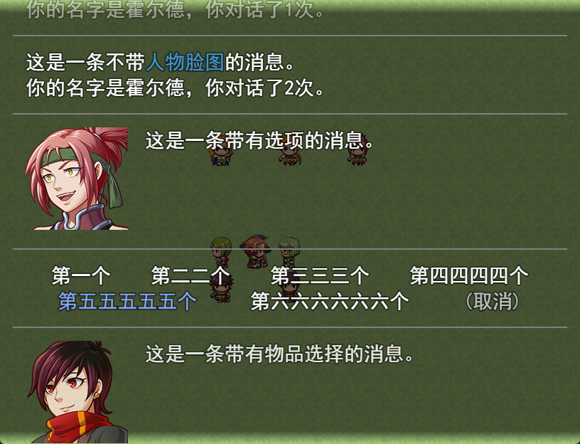

# RMMVMessageBacklog
A simple message backlog plugin for RPG Maker MV.

## Configuration

| Parameter  | Default | Description                                                  |
| ---------- | ------- | ------------------------------------------------------------ |
| key        | tab     | The key for calling the message backlog window (enabled on the map only) |
| capacity   | 100     | The capacity of the message backlog                          |
| cancelText | (取消)  | The default text for cancellation                            |
| enableSave | true    | To store the message backlog in saves                        |

## Demo

